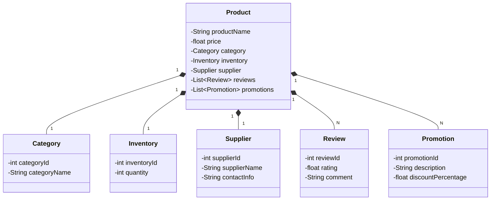

# Santander Dev Week 2023

Java RESTful API criada para a Santander Dev Week. 
API simula o cadastro de produtos em uma loja.

## Diagrama de Classes

```mermaid
classDiagram
    class Product {
        -String productName
        -float price
        -Category category
        -Inventory inventory
        -Supplier supplier
        -List~Review~ reviews
        -List~Promotion~ promotions
    }

    class Category {
        -int categoryId
        -String categoryName
    }

    class Inventory {
        -int inventoryId
        -int quantity
    }

    class Supplier {
        -int supplierId
        -String supplierName
        -String contactInfo
    }

    class Review {
        -int reviewId
        -float rating
        -String comment
    }

    class Promotion {
        -int promotionId
        -String description
        -float discountPercentage
    }

    Product "1" *-- "1" Category
    Product "1" *-- "1" Inventory
    Product "1" *-- "1" Supplier
    Product "1" *-- "N" Review
    Product "1" *-- "N" Promotion
```
